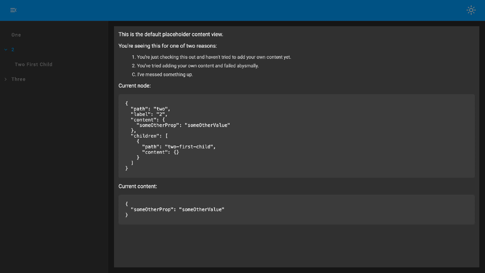

# Dynamic Routes Ngx
<br/>

# What.

An Angular implementation of `@jamesbenrobb/dynamic-routes`.

[Demo](https://app-shell.jamesrobb.work/dynamic-routes-demo)

**Note** - Only the highlighted area in *Fig 1.* relates to this library.

The surrounding UI in the demo is part of a separate library ([`@jamesbenrobb/app-shell`](https://github.com/jamesbrobb/app-shell)) and is used in this instance to:

1. Facilitate user route changes
2. Demonstrate the composable nature of this library


*Fig 1. Only the highlighted area relates to this library and is the default content displayed when using the <jbr-dra-app-content-container> component*

<br/><br/>

# Why.

Whilst creating [Documentor](https://github.com/jamesbrobb/documentor) (which required dynamic/configurable routes) it became apparent that it would be useful to abstract and decouple the underlying implementation/behaviour to use in other apps.
<br/><br/>

# What not.

A replacement for complex routing.
<br/><br/>

# How.

1. [Install](#install)
2. [Define route config json](#define-route-config-json)
3. [Add providers](#add-providers)
4. [Add component](#add-component)
5. [Interact with router](#interact-with-router)
6. [Extending for your own use](#extending-for-your-own-use)
<br/><br/>

### Install

```bash
npm i @jamesbenrobb/dynamic-routes-ngx@latest
```
<br/>

### Define route config json

```json
{
  "routes": [{
    "path": "/",
    "redirectTo": "one"
  }, {
    "path": "one",
    "content": {
      "someProp": "someValue"
    }
  }, {
    "path": "two",
    "label": "2",
    "content": {
      "someOtherProp": "someOtherValue"
    },
    "children": [{
      "path": "two-first-child",
      "content": {}
    }]
  }, {
    "path": "three",
    "content": {
      "someOtherProp": "someOtherValue"
    },
    "children": [{
      "path": "three-first-child",
      "content": {}
    }, {
      "path": "three-second-child",
      "content": {},
      "children": [{
        "path": "three-second-child-first-child",
        "content": {}
      }]
    }]
  }]
}
```
<br/>

### Add providers

```ts
import {ApplicationConfig} from '@angular/core';
import {getJBRDRAppProviders} from "@jamesbenrobb/dynamic-routes-ngx";


export const appConfig: ApplicationConfig = {
  providers: [
    getJBRDRAppProviders(
      'assets/route-config.json'
    )
  ]
};
```
<br/>

### Add component

```ts
import { Component } from '@angular/core';
import {AppContentContainerComponent} from "@jamesbenrobb/dynamic-routes-ngx";


@Component({
  selector: 'app-root',
  standalone: true,
  imports: [
    AppContentContainerComponent
  ],
  template: `
    <jbr-dra-app-content-container>
    </jbr-dra-app-content-container>
  `,
  styleUrl: './app.component.scss'
})
export class AppComponent {}
```
<br/>

### Interact with router

The `RouteManager` can be injected and exposes the following API:

```ts
readonly currentRouteNodes$: Observable<RouteNode<T>[]>;
readonly urlChange$: Observable<string>;
get routes(): RouteNode<T>[];
```
```ts
navigateByUrl(path: string): void;
navigateByNode(node: RouteNode<T>): void;
```
<br/>

# Extending for your own use.

1. [Provider options](#provider-options)
2. [Add your own content component](#add-your-own-content-component)
<br/><br/>
 
### Provider options

```ts
export type JBRDRAppProvidersOptions<T extends ContentNodeContentType> = {
  appName?: string,
  getAllChildNodes?: getAllChildNodes<T>
  contentComponentType?: string
}
```
<br/>

### Add your own content component

Create a component that implements [`ContentLoaderComponentIO`](https://github.com/jamesbrobb/dynamic-routes/blob/main/libraries/dynamic-routes-ngx/src/lib/components/app-content-loader/app-content-loader.directive.ts)

```ts
import {Component, Output} from "@angular/core";
import {ContentLoaderComponentIO} from "@jamesbenrobb/dynamic-routes-app";

@Component({
  selector: 'my-content-component',
  templateUrl: '...',
  styleUrls: ['...'],
  standalone: true
})
export class MyContentComponent implements ContentLoaderComponentIO<YourContentType> {
  @Input() routeNodes?: RouteNode<YourContentType>[] | undefined
  @Input() currentNode?: RouteNode<YourContentType> | undefined
  @Input() currentContent?: YourContentType | undefined

  @Output() routeSelected = new EventEmitter<RouteNode<>>(); // this is optional
}
```

Register the component with the `ComponentLoaderMapService` (see details on registering components [here](https://github.com/jamesbrobb/jbr/tree/main/libraries/ui/src/lib/component-loader)) and add the provider to your app

```ts
import {Provider} from "@angular/core";
import {ComponentLoaderMapService} from "@jamesbenrobb/ui";


const provider: Provider = {
  provide: ComponentLoaderMapService,
  useValue: {
    'my-content-component': {
      import: () => import('./my-content.component'),
      componentName: 'MyContentComponent'
    }
  },
  multi: true
}
```

Supply the registered name of you content component to `getJBRDRAppProviders`

```ts
import {ApplicationConfig} from '@angular/core';
import {getJBRDRAppProviders} from "@jamesbenrobb/dynamic-routes-ngx";


export const appConfig: ApplicationConfig = {
  providers: [
    getJBRDRAppProviders(
      'assets/route-config.json',
      {
        appName: 'My app name',
        contentComponentType: 'my-content-component'
      }
    )
  ]
};
```
